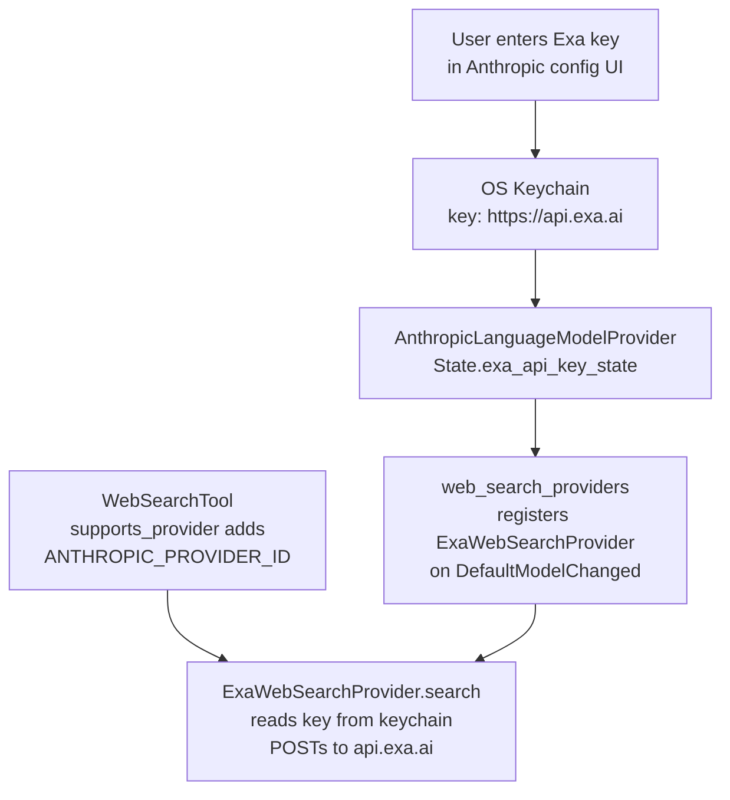

# Anthropic provider: Exa web search support

## Goal
Extend the existing `WebSearchTool` to work when Anthropic is the active language model provider. A new `ExaWebSearchProvider` will call the Exa search API (`api.exa.ai`) and map its results to the shared `WebSearchResponse` type. The Exa API key is stored securely in the OS keychain via `CredentialsProvider` (same mechanism used for the Anthropic API key). Users configure it through a new input section in the Anthropic provider settings UI.

## Context & Assumptions
- `WebSearchTool` lives at `crates/agent/src/tools/web_search_tool.rs:66` and currently gates to `ZED_CLOUD_PROVIDER_ID` only.
- Web search backends implement `WebSearchProvider` (`crates/web_search/src/web_search.rs`) and are registered in a global `WebSearchRegistry`.
- The only current backend is `CloudWebSearchProvider` (`crates/web_search_providers/src/cloud.rs`), managed in `crates/web_search_providers/src/web_search_providers.rs`.
- `AnthropicLanguageModelProvider::State` already holds an `ApiKeyState` + `Arc<dyn CredentialsProvider>` for the Anthropic API key (`crates/language_models/src/provider/anthropic.rs:44`). The Exa key will follow the same pattern.
- `ApiKeyState` (`crates/language_model/src/api_key.rs`) manages load/store to the OS keychain keyed by a URL string, and supports env-var fallback.
- `Client::credentials_provider()` (public, `crates/client/src/client.rs:593`) returns the same `Arc<dyn CredentialsProvider>` instance used by all LLM providers, so the key written by the Anthropic config view is readable by `web_search_providers`.
- `web_search_providers` already uses `client.http_client()`. Adding `credentials_provider.workspace = true` introduces no circular dependency.
- Exa API: `POST https://api.exa.ai/search`, `x-api-key` header, JSON body `{"query":…,"numResults":10,"contents":{"text":{"maxCharacters":1000}}}`, response has `results[].{title, url, text}`.
- Scope: Anthropic provider only.

## Architecture



**Key lifetime:** The Exa key is read from the keychain on every `search()` call, so key changes are automatically picked up without re-registering the provider. The `ExaWebSearchProvider` is registered whenever Anthropic is the active LLM (unregistered otherwise); if the key is missing, the search fails with an actionable error message.

## Files Touched
- `crates/language_models/src/provider/anthropic.rs` — add `exa_api_key_state: ApiKeyState` to `State`; add `set_exa_api_key` / `reset_exa_api_key`; update `authenticate`; extend `ConfigurationView`
- `crates/web_search_providers/src/exa.rs` (**new**) — `ExaWebSearchProvider` implementing `WebSearchProvider`
- `crates/web_search_providers/src/web_search_providers.rs` — add `register_exa_web_search_provider`, wire into init and `DefaultModelChanged` handler
- `crates/web_search_providers/Cargo.toml` — add `credentials_provider` workspace dep
- `crates/agent/src/tools/web_search_tool.rs` — update `supports_provider` to accept `ANTHROPIC_PROVIDER_ID`

## TODO

- [ ] **Exa key state in `AnthropicLanguageModelProvider`** — In `crates/language_models/src/provider/anthropic.rs`:
  - Add constants:
    ```rust
    const EXA_API_KEY_ENV_VAR_NAME: &str = "EXA_API_KEY";
    static EXA_API_KEY_ENV_VAR: LazyLock<EnvVar> = env_var!(EXA_API_KEY_ENV_VAR_NAME);
    const EXA_API_URL: &str = "https://api.exa.ai";
    ```
  - Add `exa_api_key_state: ApiKeyState` to `State`, initialised as `ApiKeyState::new(EXA_API_URL.into(), (*EXA_API_KEY_ENV_VAR).clone())`.
  - Add `State::set_exa_api_key(key: Option<String>, cx) -> Task<Result<()>>` — mirrors `set_api_key` but calls `exa_api_key_state.store(EXA_API_URL.into(), …)`.
  - Extend `State::authenticate` to also call `exa_api_key_state.load_if_needed(…)` (ignore its error — Exa key is optional).

- [ ] **Exa key configuration UI** — In `ConfigurationView`:
  - Add an `exa_api_key_editor: Entity<InputField>` field.
  - In `ConfigurationView::new`, initialise it similarly to `api_key_editor`; load Exa key state alongside the Anthropic key load task.
  - Add `save_exa_api_key` (on `menu::Confirm`) and `reset_exa_api_key` methods, each calling the corresponding `State` methods above.
  - In `Render for ConfigurationView`: below the existing Anthropic key card/editor, render a separate Exa section. When authenticated with Anthropic:
    - If no Exa key: show a compact input with a link to `https://dashboard.exa.ai/api-keys` and a note that it enables the `search_web` tool.
    - If Exa key set: show a `ConfiguredApiCard` with a reset button (same disabled-if-env-var logic using `EXA_API_KEY_ENV_VAR_NAME`).

- [ ] **Exa provider** — Create `crates/web_search_providers/src/exa.rs`:
  - `pub const EXA_WEB_SEARCH_PROVIDER_ID: &str = "exa.ai";`
  - `pub const EXA_API_URL: &str = "https://api.exa.ai";`
  - `pub struct ExaWebSearchProvider { http_client: Arc<dyn HttpClient>, credentials_provider: Arc<dyn CredentialsProvider> }`
  - `impl WebSearchProvider`:
    - `id()` → `WebSearchProviderId(EXA_WEB_SEARCH_PROVIDER_ID.into())`
    - `search(query, cx)` → `cx.spawn(async move |cx| { … })` that:
      1. Reads `credentials_provider.read_credentials(EXA_API_URL, &cx).await?`
      2. Returns `Err` with a user-facing message if no key is found.
      3. Spawns `cx.background_spawn(perform_exa_search(http_client, api_key, query))` for the actual HTTP work.
  - Private `perform_exa_search` async fn: POSTs to `https://api.exa.ai/search` with `x-api-key` header, deserialises response, maps to `WebSearchResponse`.
  - Private serde structs (`ExaSearchRequest`, `ExaSearchResponse`, `ExaResult`) separate from the shared `WebSearchResponse` type.

- [ ] **Provider registration** — In `crates/web_search_providers/src/web_search_providers.rs`:
  - Add `mod exa;` at the top.
  - Extract `client.credentials_provider()` in `init` and thread it to `register_web_search_providers`.
  - Add `register_exa_web_search_provider(registry, http_client, credentials_provider, language_model_registry, cx)`:
    - If Anthropic is the currently-active LLM provider → `registry.register_provider(ExaWebSearchProvider::new(http_client, credentials_provider), cx)`.
    - Otherwise → `registry.unregister_provider(WebSearchProviderId(exa::EXA_WEB_SEARCH_PROVIDER_ID.into()))`.
  - Call it once on init (alongside the existing `register_zed_web_search_provider` call).
  - Extend the existing `DefaultModelChanged` subscription handler to also call `register_exa_web_search_provider`.

- [ ] **Cargo deps** — In `crates/web_search_providers/Cargo.toml` add:
  ```toml
  credentials_provider.workspace = true
  ```

- [ ] **Tool provider gate** — In `crates/agent/src/tools/web_search_tool.rs`:
  - Import `ANTHROPIC_PROVIDER_ID` from `language_model`.
  - Update `supports_provider`:
    ```rust
    fn supports_provider(provider: &LanguageModelProviderId) -> bool {
        provider == &ZED_CLOUD_PROVIDER_ID || provider == &ANTHROPIC_PROVIDER_ID
    }
    ```

- [ ] **Manual validation**: In `settings.json` remove any prior `exa_api_key` field. Select a Claude model. Open the Anthropic provider settings and enter an Exa key. Issue a query requiring web search and verify results appear. Then reset the Exa key and verify the tool returns "Exa API key not configured". Also verify `EXA_API_KEY` env var is picked up without UI input.

## Open Questions
None.

## Decisions Log
- Initial scope: Anthropic provider only, Exa as the sole backend, API key in plaintext settings.
- Revised: store Exa API key in OS keychain via `CredentialsProvider`, same as Anthropic key.
- Revised: add Exa key input to Anthropic `ConfigurationView`.
- Scope confirmed: Anthropic only (no other providers).
